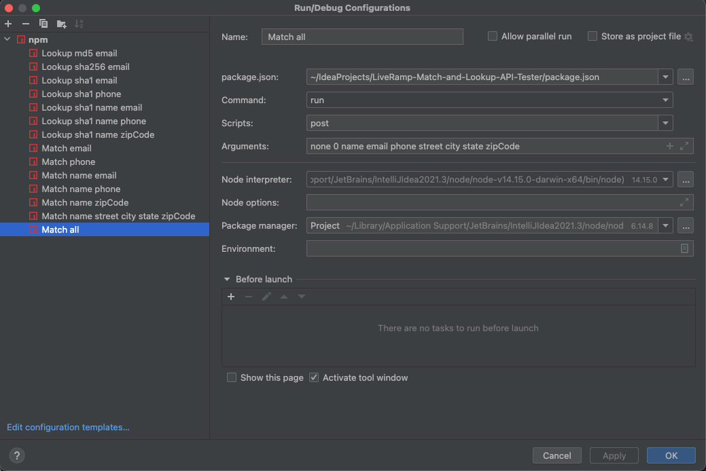

# LiveRamp Match and Lookup API Test Suite

## Important Security Notes

1. **Do not share the credentials in ClientCredentials.js!**
2. **Do not share Personally identifiable information (PII) in PII.csv PII.xlsx!**

## Installation & Running

1. Install [node.js](https://nodejs.org/en/)
2. Command line: npm install
3. Edit the required fields in ClientCredentials.js 
4. Fill in test data in PII.json with a **minimum** of 101 entries
5. Command line: npm run post {encryption} {limit} {list of fields to parse from PII.json}

- npm run post starts the program
- {encryption} can be "none", "sha1", "sha256", or "md5" if your PII includes emails only. 
- {encryption} can be "none" or "sha1" if your PII includes more than emails.
- limit must be zero, adding the limit parameter causes the request to fail. There is an open question to LR support about why this is the case

Valid combination of parameters are:
  - Lookup Endpoint
    - md5 0 email
    - sha256 0 email
    - sha1 0 email
    - sha1 0 phone
    - sha1 0 name email
    - sha1 0 name phone
    - sha1 0 name zipCode
  - Match Endpoint
    - none 0 email
    - none 0 phone
    - none 0 name email
    - none 0 name phone
    - none 0 name zipCode
    - none 0 name street [city?] [state?] zipCode 
    - none 0 name email phone street [city?] [state?] zipCode
  
   
  This can be set up in IntelliJ IDEA easily using npm configs, but you still need to open package.json and click on the "run npm install" toast that appears at the bottom of the screen
    

## Liveramp Links:

- The Match Endpoint: https://developers.liveramp.com/retrieval-api/reference/batch-request-calls-match
- Error codes: https://developers.liveramp.com/retrieval-api/docs/error-document
- RampIDs explained: https://developers.liveramp.com/retrieval-api/docs/rampids
- Bucket upload : https://docs.liveramp.com/connect/en/getting-your-data-into-liveramp.html
- 10,000 myriad IDs https://docs.liveramp.com/connect/en/interpreting-rampid,-liveramp-s-people-based-identifier.html
- How does the RampID get into the bid request? https://sidecar.readme.io/docs/using-idls-in-openrtb

## Expected Match Rates

### Test 1

50,000 records from Alaska

| DataSet | Endpoint | Encryption | Limit | Fields                                   | Pre-valdation Rows | Total Rows Submitted | Validation Pass-rate | Match Rate MaintainedID per Pre-validated | Match Rate MaintainedID per Post-validated | Total Results | Total HTTP 200 Results | Total HTTP 4xx Results | Derived RampIDs Returned | Maintained RampIDs Returned |
| ------- | -------- | ---------- | ----- | ---------------------------------------- | ------------------ | -------------------- | -------------------- | ----------------------------------------- | ------------------------------------------ | ------------- | ---------------------- | ---------------------- | ------------------------ | --------------------------- |
| Alaska  | Match    | none       | 0     | all                                      | 50000              | 50000                | 100.0%               | 96.3%                                     | 96.3%                                      | 50000         | 49973                  | 27                     | 1823                     | 48150                       |
| Alaska  | Match    | none       | 0     | name street \[city?\] \[state?\] zipCode | 50000              | 44606                | 89.2%                | 80.9%                                     | 90.6%                                      | 44606         | 44579                  | 27                     | 4149                     | 40430                       |
| Alaska  | Match    | none       | 0     | name zipCode                             | 50000              | 44606                | 89.2%                | 79.4%                                     | 89.0%                                      | 44606         | 44594                  | 12                     | 4897                     | 39697                       |
| Alaska  | Lookup   | md5        | 0     | email                                    | 50000              | 38404                | 76.8%                | 53.7%                                     | 69.9%                                      | 38404         | 38404                  | 0                      | 11566                    | 26838                       |
| Alaska  | Lookup   | sha256     | 0     | email                                    | 50000              | 38404                | 76.8%                | 53.7%                                     | 69.9%                                      | 38404         | 38404                  | 0                      | 11566                    | 26838                       |
| Alaska  | Lookup   | sha1       | 0     | email                                    | 50000              | 38404                | 76.8%                | 53.7%                                     | 69.9%                                      | 38404         | 38404                  | 0                      | 11566                    | 26838                       |
| Alaska  | Match    | none       | 0     | email                                    | 50000              | 38404                | 76.8%                | 53.7%                                     | 69.9%                                      | 38404         | 38404                  | 0                      | 11566                    | 26838                       |
| Alaska  | Match    | none       | 0     | name email                               | 50000              | 38404                | 76.8%                | 53.7%                                     | 69.9%                                      | 38404         | 38392                  | 12                     | 11562                    | 26830                       |
| Alaska  | Lookup   | sha1       | 0     | phone                                    | 50000              | 32758                | 65.5%                | 51.2%                                     | 78.2%                                      | 32758         | 32758                  | 0                      | 7156                     | 25602                       |
| Alaska  | Match    | none       | 0     | phone                                    | 50000              | 32758                | 65.5%                | 51.1%                                     | 78.1%                                      | 32758         | 32758                  | 0                      | 7185                     | 25573                       |
| Alaska  | Match    | none       | 0     | name phone                               | 50000              | 32758                | 65.5%                | 51.1%                                     | 78.1%                                      | 32758         | 32754                  | 4                      | 7185                     | 25569                       |
| Alaska  | Lookup   | sha1       | 0     | name email                               | 50000              | 38404                | 76.8%                | 42.2%                                     | 55.0%                                      | 38404         | 38404                  | 0                      | 17286                    | 21118                       |
| Alaska  | Lookup   | sha1       | 0     | name phone                               | 50000              | 32758                | 65.5%                | 36.8%                                     | 56.2%                                      | 32758         | 32758                  | 0                      | 14360                    | 18398                       |
| Alaska  | Lookup   | sha1       | 0     | name zipCode                             | 50000              | 44606                | 89.2%                | 19.5%                                     | 21.8%                                      | 44606         | 44606                  | 0                      | 34866                    | 9740                        |

### Test 2

80,000 records from California (does not contain phone numbers)

| DataSet    | Endpoint | Encryption | Limit | Fields                                   | Pre-valdation Rows | Total Rows Submitted | Validation Pass-rate | Match Rate MaintainedID per Pre-validated | Match Rate MaintainedID per Post-validated | Total Results | Total HTTP 200 Results | Total HTTP 4xx Results | Derived RampIDs Returned | Maintained RampIDs Returned |
| ---------- | -------- | ---------- | ----- | ---------------------------------------- | ------------------ | -------------------- | -------------------- | ----------------------------------------- | ------------------------------------------ | ------------- | ---------------------- | ---------------------- | ------------------------ | --------------------------- |
| California | Match    | none       | 0     | all                                      | 80000              | 80000                | 100.0%               | 94.5%                                     | 94.5%                                      | 80000         | 79979                  | 21                     | 4396                     | 75583                       |
| California | Match    | none       | 0     | name street \[city?\] \[state?\] zipCode | 80000              | 80000                | 100.0%               | 91.6%                                     | 91.6%                                      | 80000         | 79979                  | 21                     | 6712                     | 73267                       |
| California | Match    | none       | 0     | name zipCode                             | 80000              | 80000                | 100.0%               | 89.6%                                     | 89.6%                                      | 80000         | 79980                  | 20                     | 8278                     | 71702                       |
| California | Lookup   | sha1       | 0     | name zipCode                             | 80000              | 80000                | 100.0%               | 86.4%                                     | 86.4%                                      | 80000         | 80000                  | 0                      | 10892                    | 69108                       |
| California | Lookup   | md5        | 0     | email                                    | 80000              | 68149                | 85.2%                | 62.4%                                     | 73.3%                                      | 68149         | 68149                  | 0                      | 18198                    | 49951                       |
| California | Lookup   | sha256     | 0     | email                                    | 80000              | 68149                | 85.2%                | 62.4%                                     | 73.3%                                      | 68149         | 68149                  | 0                      | 18198                    | 49951                       |
| California | Lookup   | sha1       | 0     | email                                    | 80000              | 68149                | 85.2%                | 62.4%                                     | 73.3%                                      | 68149         | 68149                  | 0                      | 18198                    | 49951                       |
| California | Match    | none       | 0     | email                                    | 80000              | 68149                | 85.2%                | 62.4%                                     | 73.3%                                      | 68149         | 68149                  | 0                      | 18199                    | 49950                       |
| California | Match    | none       | 0     | name email                               | 80000              | 68149                | 85.2%                | 62.4%                                     | 73.3%                                      | 68149         | 68130                  | 19                     | 18195                    | 49935                       |
| California | Lookup   | sha1       | 0     | name email                               | 80000              | 68149                | 85.2%                | 51.6%                                     | 60.6%                                      | 68149         | 68149                  | 0                      | 26880                    | 41269                       |
| California | Lookup   | sha1       | 0     | phone                                    | 80000              | 0                    | 0.0%                 | 0.0%                                      | 0.0%                                       | 0             | 0                      | 0                      | 0                        | 0                           |
| California | Lookup   | sha1       | 0     | name phone                               | 80000              | 0                    | 0.0%                 | 0.0%                                      | 0.0%                                       | 0             | 0                      | 0                      | 0                        | 0                           |
| California | Match    | none       | 0     | phone                                    | 80000              | 0                    | 0.0%                 | 0.0%                                      | 0.0%                                       | 0             | 0                      | 0                      | 0                        | 0                           |
| California | Match    | none       | 0     | name phone                               | 80000              | 0                    | 0.0%                 | 0.0%                                      | 0.0%                                       | 0             | 0                      | 0                      | 0                        | 0                           |

### Test 4

60,000 records from across USA (does not contain phone numbers)

| DataSet | Endpoint | Encryption | Limit | Fields                                   | Pre-valdation Rows | Total Rows Submitted | Validation Pass-rate | Match Rate MaintainedID per Pre-validated | Match Rate MaintainedID per Post-validated | Total Results | Total HTTP 200 Results | Total HTTP 4xx Results | Derived RampIDs Returned | Maintained RampIDs Returned |
| ------- | -------- | ---------- | ----- | ---------------------------------------- | ------------------ | -------------------- | -------------------- | ----------------------------------------- | ------------------------------------------ | ------------- | ---------------------- | ---------------------- | ------------------------ | --------------------------- |
| USA     | Match    | none       | 0     | all                                      | 60000              | 54656                | 91.1%                | 69.8%                                     | 76.6%                                      | 54656         | 54643                  | 13                     | 12766                    | 41877                       |
| USA     | Lookup   | md5        | 0     | email                                    | 60000              | 50684                | 84.5%                | 53.6%                                     | 63.4%                                      | 50684         | 50684                  | 0                      | 18529                    | 32155                       |
| USA     | Lookup   | sha256     | 0     | email                                    | 60000              | 50684                | 84.5%                | 53.6%                                     | 63.4%                                      | 50684         | 50684                  | 0                      | 18529                    | 32155                       |
| USA     | Lookup   | sha1       | 0     | email                                    | 60000              | 50684                | 84.5%                | 53.6%                                     | 63.4%                                      | 50684         | 50684                  | 0                      | 18529                    | 32155                       |
| USA     | Match    | none       | 0     | email                                    | 60000              | 50684                | 84.5%                | 53.6%                                     | 63.4%                                      | 50684         | 50684                  | 0                      | 18529                    | 32155                       |
| USA     | Match    | none       | 0     | name email                               | 60000              | 50684                | 84.5%                | 53.6%                                     | 63.4%                                      | 50684         | 50671                  | 13                     | 18523                    | 32148                       |
| USA     | Match    | none       | 0     | name street \[city?\] \[state?\] zipCode | 60000              | 26559                | 44.3%                | 37.0%                                     | 83.6%                                      | 26559         | 26552                  | 7                      | 4340                     | 22212                       |
| USA     | Match    | none       | 0     | name zipCode                             | 60000              | 26559                | 44.3%                | 37.0%                                     | 83.6%                                      | 26559         | 26552                  | 7                      | 4340                     | 22212                       |
| USA     | Lookup   | sha1       | 0     | name zipCode                             | 60000              | 26559                | 44.3%                | 35.1%                                     | 79.2%                                      | 26559         | 26559                  | 0                      | 5514                     | 21045                       |
| USA     | Lookup   | sha1       | 0     | name email                               | 60000              | 50684                | 84.5%                | 31.7%                                     | 37.5%                                      | 50684         | 50684                  | 0                      | 31681                    | 19003                       |

------- 

